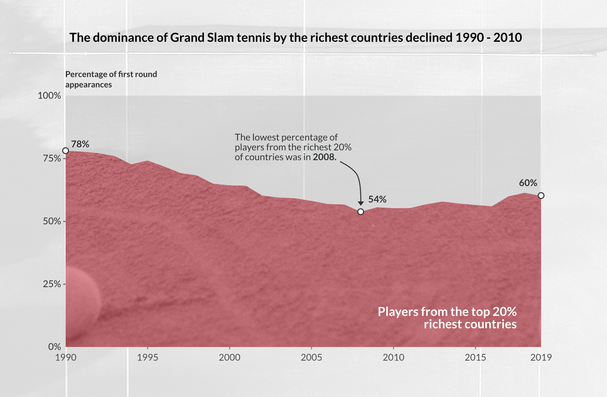

**By:** Dr. Chris Martin

**Tools / packages used:** R, R Markdown, `ggplot2`, tidyverse (inc. `dplyr` and `tidyr`), `plotly`.

**Techniques used:** exploratory data analysis, functional programming (`purrr` package), data visualisation, data cleaning/reshaping/manipulation.

**Chart types used:** area chart, line chart, bar chart, stacked bar chart, small multiples, heatmap, ridge chart, interactive charts (with `ggplotly`).

**Source data:** To produce the charts, I needed data on the women's and men's singles entrants for each Grand Slam tournament since 1990. This came from the excellent [Tennis Abstract](https://github.com/JeffSackmann).

This notebook produces the static data visualisations which features in my data storytelling project: *The Changing Fortunes of the Richest Countries in Grand Slam Tennis*. You can read the full story [on my website](https://chris-martin-information-design.netlify.app/short-data-stories/tennis). This notebook uses data processed, clean and explored in [another notebook](https://rpubs.com/chrismartin03/964176).


## A note on my data visualistion workflow

The chart produced in this notebook are 'skeletons' with fairly minimal styling, but all the key structural components in places. The chart are exported from this notebook as svgs. These can are then edited - adding textures, photos, annotations etc. - using graphic design software to create the final versions.

Some of the charts in this notebook made into the final data story, others where experiments that ultimately did no lead to a final chart. Some charts in this notebook are missing axis labels, titles etc. this is because it made the charts easier to edit further down the line in graphic design software.

## Setting up the notebook

```{r, warning = FALSE, message = FALSE}
# import packages
library(tidyverse)  # for data manipulation and viz
library(knitr)      # for formatting tables
library(kableExtra) # for formatting tables

# set default theme for exploratory plots
theme_set(theme_light())  # using a minimal theme to make it easier to edit 
                          # the plots in graphic design software later on

# set default R markdown chunk options
knitr::opts_chunk$set(echo = TRUE, warning = FALSE, message = FALSE)

# output the first lines of a dataframe in a nice format
scrollable_table <- function(df){
  df %>% 
    kable("html") %>% 
    kable_styling() %>%
    scroll_box(width = "100%", height = "200px",
               fixed_thead = list(enabled = T, background = "grey90"))
}
```

## Reading in the data

The data is read in from csvs produced in `data_clean.Rmd`, a lot of the data preparation was done in that notebook.

```{r}
gs_first_round_gdp <- read_csv("../data/results_gdp.csv") %>% 
  #just look up until covid pandemic  (as will have distorted things)
  filter(year < 2020)

# check data looks as expected
gs_first_round_gdp %>% 
  head() %>% 
  kable()

gs_entries_by_country <- read_csv("../data/gs_entries_by_country.csv") %>% 
  # just look up until covid pandemic  (as will have distorted things)
  filter(year < 2020)

# check data looks as expected
gs_entries_by_country %>% 
  head() %>% 
  kable()
```

## How have the richest 20% of countries performed at Grand Slams (1990 - 2019)?

This section focuses on how well the richest 20% of countries performed at Grand Slams (1990 - 2019). The metric used for a country's performance is how many players they had appearing in the first round of Grand Slam tennis tournaments.

### The overall trend

The performance of the richest countries declined 1900 to 2008, and then picked up again a little.

```{r}
# ----------------------------------------------------------------------------
# Reshape data for plotting
# ----------------------------------------------------------------------------
plot_df <- gs_entries_by_country %>% 
  
  # looked performance for two groups of countries
  # top 20% richest countries and the rest
  mutate(top_20_perc = if_else(is.na(top_20_perc), FALSE, top_20_perc)) %>% 
  group_by(year, top_20_perc) %>% 
  summarise(num_first_rd = sum(num_first_rd)) %>% 
  ungroup() %>%
  
  # calculate proportions from counts
  group_by(year) %>% 
  mutate(perc_first_round = num_first_rd / sum(num_first_rd)) %>% 
  ungroup()

# ----------------------------------------------------------------------------
# Produce the plot
# ----------------------------------------------------------------------------  
p <-  ggplot(plot_df) +
  
  # core chart
  geom_area(aes(year, perc_first_round, fill = top_20_perc)) +
  
  # format axis
    scale_y_continuous(labels = scales::percent_format(accuracy = 1L),
                       expand = c(0,0)) +
    scale_x_continuous(expand = c(0,0), 
                       breaks=c(1990,1995,2000,2005,2010,2015,2019)) +
    coord_cartesian(clip = 'off') +
  
  # tidy up presentation
    labs(x = NULL, y = NULL) +
    theme(legend.position = "none",
          plot.margin = margin(25,25,25,25)) 

p 

# ----------------------------------------------------------------------------
# Export the plot for editing
# ----------------------------------------------------------------------------
ggsave("../images/all_gs.svg", units = "mm", width = 600, height = 325)

```

### Is the overall trend driven by the composition of 20% richest countries changing over time?

When I saw showing early versions of the visualisation to members of the target audience, a question came up. Are the trends indentified a result of the countries in the top 20% richest changing? In this section of the notebook I reshape so I can produce a chart that shows that this isn't drivnig the trend.

```{r}
# ----------------------------------------------------------------------------
# Reshape data for plotting
# ----------------------------------------------------------------------------

# count number of first round appearances per country per year
top_twenty_countries <- gs_entries_by_country %>% 
  filter(top_20_perc) %>% 
  count(year, country, wt = num_first_rd) %>% 
  arrange(year, desc(n)) %>% 
  group_by(country) %>% 
  mutate(country_ave_n = mean(n)) %>% 
  ungroup()

# average number of appearances per country each year (1990 - 2019)
country_ave_ns <- top_twenty_countries %>% 
  distinct(country, country_ave_n)
  
# Count how many time the countries appear in the top twenty percent
top_twenty_counts <- top_twenty_countries %>% 
  count(country) %>% 
  left_join(country_ave_ns) %>% 
  arrange(desc(n), desc(country_ave_n)) %>% 
  rename(years_top_20 = n)
  

# this will be useful later for ordering the countriesin the plot
levels <- top_twenty_counts$country

# create a grid to see where countries have moved out of top 20 perc
grid <-  expand_grid(year = unique(top_twenty_countries$year),
                     country = unique(top_twenty_countries$country))

# identify implicitly missing data
plot_df <- grid %>% 
  left_join(top_twenty_countries)

# identify countries in bottom 80%
bottom_80_countries_by_year <- gs_entries_by_country %>% 
  distinct(year, country, income_decile) %>% 
  filter(income_decile < 9)

# function for checking if a country is the bottom 80% in a given year
check_bottom_80 <- function(year, country){

  selector <- bottom_80_countries_by_year$year == year & 
              bottom_80_countries_by_year$country == country
  
  res <- bottom_80_countries_by_year[selector, ]
  
  if(nrow(res) == 0){
    return(FALSE)
    }
  else {
    return(res[[1,"income_decile"]] < 9)
  }
}

# quick test of check_bottom_80()
check_bottom_80(1990, "Nigeria")

# update plotting dataframe with variable recording if a country is the bottom 80% 
# in a given year
plot_df_1 <- plot_df %>% 
  mutate(in_bottom_80 = map2_lgl(year, country, ~check_bottom_80(.x,.y)),
         n = if_else(is.na(n) & in_bottom_80,
                     -1, n),
         n = replace_na(n, 0),
         bin_n = cut(n, breaks = c(-Inf, -1e-10,0,1e10, 10, 50, 100, Inf)))  

# ----------------------------------------------------------------------------
# Produce the plot
# ----------------------------------------------------------------------------

p <- ggplot(plot_df_1) +
  
      # core plot
      geom_tile(aes(x = year, 
                    y = factor(country, levels = rev(levels)),
                    fill = bin_n),
                colour = "#F8F7F7") +
      
      # plot text
      labs(x= NULL, y = NULL) +
      guides(fill = guide_legend(reverse=TRUE)) +
      
      # colours
      scale_fill_manual(values = c("#E7E4E5", "white", '#cfcde7', 
                                   '#9f9dce', '#6e70b6', '#35469d')) +
      # simplify plot for editting
      scale_x_continuous(position = "top") +
      coord_equal() +  
      theme_minimal()
  
p

# output plot for editing
ggsave("../images/image_4.svg")

# a quick test to confirm that the plot makes sense
gs_entries_by_country %>% 
  filter(country == "Israel") %>% 
  distinct(year, income_decile) %>% 
  scrollable_table()
```

### The decline of the richest countries

Having established the overall trend is not an artifact of countries moving in and out the richest 20%, this section looks in detail at decline of the richest countries performance 1990-2008.

```{r}
# ----------------------------------------------------------------------------
# Reshape data for plotting
# ----------------------------------------------------------------------------

# simplify representation of missing data
gs_entries_by_country_clean <- gs_entries_by_country %>% 
  mutate(top_20_perc = if_else(is.na(top_20_perc), FALSE, top_20_perc))

# count first round appearance for all countries by year
all_gs_entries_by_country <- gs_entries_by_country_clean %>% 
  
  group_by(year, country) %>% 
  summarise(num_first_rd_year = sum(num_first_rd)) %>% 
  ungroup() %>% 
  
  left_join(distinct(gs_entries_by_country_clean, country, 
                     year, top_20_perc)) %>%

  group_by(year) %>%
  mutate(perc_first_round = num_first_rd_year / sum(num_first_rd_year)) %>%
  ungroup()

# output to check counts make sense for top 20 vs bottom 80
all_gs_entries_by_country %>% 
  group_by(year, top_20_perc) %>% 
  summarise(perc_first_round = sum(perc_first_round)) %>% 
  scrollable_table()

# focus on top 20 entries
gs_entries_top_20_perc <- all_gs_entries_by_country %>% 
  filter(top_20_perc)

# identify implicitly missing data
grid <- expand_grid(year = unique(gs_entries_top_20_perc$year),
                    country = unique(gs_entries_top_20_perc$country))
  
# create variables needed for plotting
plot_df <- grid %>% 
  left_join(gs_entries_top_20_perc) %>% 
  mutate(perc_first_round = replace_na(perc_first_round, 0)) %>% 
  filter(year <= 2008) %>% 
  mutate(is_usa = country == "United States")

# calculate change in performance (per country) 
# compares number of first round appearance 1990 to 2008
# for grouping, ordering and colouring countries in the area chart
change_df <- plot_df %>% 
  
  filter(year == max(year) | year == min(year)) %>% 
  select(year, country, perc_first_round) %>% 
  
  pivot_wider(names_from = year,
              values_from = perc_first_round,
              values_fill = 0) %>% 
  mutate(change = `2008` - `1990`,
         fall = change < 0,
         change_bin = cut(change, 
                          breaks = c(-Inf, -0.1, -0.02, 0.02, 0.1, Inf))) %>% 
  arrange(change)

# add in change in performance to dataframe for plotting
plot_df_1 <- plot_df %>% 
  
  left_join(change_df) %>% 
  
  group_by(country) %>% 
  mutate(ave_num_first_round = mean(num_first_rd_year, na.rm = TRUE)) %>% 
  ungroup() %>% 

  arrange(fall, desc(change)) %>% 
  mutate(country = factor(country, levels = unique(country)))

# ----------------------------------------------------------------------------
# Produce the plot
# ----------------------------------------------------------------------------

p <- ggplot(plot_df_1) +
  
  # core plot
      geom_area(aes(year, perc_first_round,
                  group = country,
                  fill = change_bin),
              colour = "grey80", size = 0.2) +
    
      # colours
      scale_fill_manual(values = c("#c94a54", "#efb3aa", 
                                   "#fffff0", "#aeabcd")) +
      # format axis
      scale_y_continuous(labels = scales::percent_format(accuracy = 1L),
                         breaks = c(seq(0,0.8,0.1)),
                         expand = expansion(mult = c(0, .1))) +
      scale_x_continuous(expand = c(0,0), 
                         breaks=c(1990,1995,2000,2005,2008)) +
    
      # simplify plot for editting
      labs(x = NULL, y = NULL) +
      theme(legend.position = "none",
            plot.margin = margin(25,25,25,25)) 


p

# output plot for editting
ggsave("../images/image_5.svg", units = "mm", width = 525, height = 350)

# output plot as interactive for inspection
plotly::ggplotly(p)

# ----------------------------------------------------------------------------
# Get the information needed to annotate the plot
# ----------------------------------------------------------------------------

levels(plot_df_1$change_bin)

# get data points for plot annotation
plot_df_1 %>% 
  filter(country %in% c("United States", "Australia", "Sweden")) %>% 
  group_by(year) %>% 
  summarise(perc_first_round_tot = sum(perc_first_round)) %>% 
  scrollable_table()

plot_df_1 %>% 
  filter(country == "United States") %>% 
  group_by(year) %>% 
  summarise(perc_first_round_tot = sum(perc_first_round)) %>% 
  scrollable_table()

# get players from a country in a given year (for annotation)
get_players <- function(country_str, year_int){
  gs_first_round_gdp %>% 
  filter(country == country_str & year == year_int) %>% 
  distinct(name)
}

get_players("United States", 1990) %>% 
  scrollable_table()

get_players("United States", 2008) %>% 
  scrollable_table()

```

### The mini resurgence of the richest countries

After 2008 there is an improvement in the performance of the richest countries. This chunk of code produces a plot that focusses in on this trend.

```{r}
# ----------------------------------------------------------------------------
# Reshape data for plotting
# ----------------------------------------------------------------------------

# focus on 2009 onwards and find implicitly missing data
plot_df <- grid %>% 
  
  left_join(gs_entries_top_20_perc) %>% 
  mutate(perc_first_round = replace_na(perc_first_round, 0)) %>% 
  filter(year > 2008)

# calculate change in performance of coutries between 2009 and 2019
change_df <- plot_df %>% 
  
  filter(year == max(year) | year == min(year)) %>% 
  select(year, country, perc_first_round) %>% 
  
  pivot_wider(names_from = year,
              values_from = perc_first_round,
              values_fill = 0) %>% 
  
  mutate(change = `2019` - `2009`,
         fall = change < 0,
         # create bins for grouping countries
         change_bin = cut(change, 
                          breaks = c(-Inf, -0.1, -0.02, 0.02, 0.1, Inf))) %>% 
  arrange(change)

# define countries of particular interest for in plot
countries_of_int <-  c("United States", "France", "Sweden", "Australia", "Spain")

# group all the other (not of specific interest) countries
plot_df_1 <- plot_df %>% 
  
  left_join(change_df) %>% 
  
  mutate(country = if_else(country %in% countries_of_int, 
                           country, 
                           "Other")) %>% 
  
  group_by(country, year) %>%
  summarise(perc_first_round = sum(perc_first_round)) %>% 
  ungroup()
  
# define order of the facets within the plot
facet_order <- c("United States", "Australia", "Sweden", "France", "Spain", "Other")

# create annotation layer for plot
annotation_df <- plot_df_1 %>% 
  mutate(label = round(perc_first_round * 100, 1),
         num_appearances = round(perc_first_round * 256)) %>% 
  filter(year == max(plot_df_1$year)|
           year == min(plot_df_1$year))
# ----------------------------------------------------------------------------
# Produce the plot
# ----------------------------------------------------------------------------

p <- ggplot(plot_df_1,
            aes(year, perc_first_round)) +
  
      # core plot
      geom_area(aes(group = country),
                colour = "grey80", size = 0.2) +
  
      # annotation
      ggrepel::geom_text_repel(data = annotation_df,
                               mapping = aes(label = num_appearances)) +
      
      # create small multiples
      facet_wrap(~factor(country, levels = facet_order))

p
```

### The most succesful countries in the richest 20%

This section focuses in on the most successful countries: I had noticed that the USA, France and Spain had been very prominent around 2008. The aim here is to see which countries was the most successful at any given point in time.

```{r}
# ----------------------------------------------------------------------------
# Reshape data for plotting
# ----------------------------------------------------------------------------
gs_first_round_gdp %>% 

  count(year, country, iso) %>% 
  group_by(year) %>% 
  mutate(perc_appear = n / sum(n)) %>% 
  
  filter(iso %in% c("USA", "FRA", "ESP")) %>% 
  
  # --------------------------------------------------------------------------
  # Produce the plot
  # --------------------------------------------------------------------------
  ggplot() +
  geom_line(aes(year, perc_appear, colour = country))
```

Below I try an alternative approach, where all the other coutries are added into the plot two. To see if this feels like it adds some useful context. It doesn't look like it does.

```{r}
# ----------------------------------------------------------------------------
# Reshape data for plotting
# ----------------------------------------------------------------------------
country_group_counts <- gs_first_round_gdp %>% 
  count(year, country, iso) %>% 
  mutate(colour = if_else(
    iso %in% c("USA", "FRA", "ESP"), iso, "other"
  )) 

# ----------------------------------------------------------------------------
# Produce the plot
# ----------------------------------------------------------------------------
country_group_counts %>% 
  
  ggplot() +
  
    # core plot
    geom_line(aes(year, n, group = country, colour = colour)) +
    
    # format axis 
    scale_y_continuous(expand = c(0,0)) +
    scale_x_continuous(expand = c(0,0), 
                         breaks=c(1990,1995,2000,2005,2010,2015,2019)) +
    coord_cartesian(clip = 'off') +
    
    # tidy up plot for editting
    labs(x = NULL, y = NULL) +
    theme(legend.position = "none",
          plot.margin = margin(25,25,25,25),
          panel.grid.minor = element_blank()) 

# export plot for editting
ggsave("../images/image_7.svg", units = "mm", width = 525, height = 350)

```
For context I wanted to take a look at the other countries that had been in the top 3 over time.
```{r}
# identify and explore the top 3 countries in each year
top_3 <- gs_first_round_gdp %>% 
  count(year, country) %>% 
  arrange(year, desc(n)) %>% 
  group_by(year) %>% 
  mutate(rank = rank(-n)) %>% 
  ungroup() %>% 
  
  filter(rank == 1 | rank == 2 | rank == 3)

top_3 %>% 
  scrollable_table()

```

## Which Countries outside the top twenty percent were most successful?

Looking beyond the top 20%, I wanted to see which other countries had been successful.

```{r}
# ----------------------------------------------------------------------------
# Reshape data for plotting
# ----------------------------------------------------------------------------

# count first round appearance for countries outside top 20%
gs_entries_the_other_80 <- gs_entries_by_country %>% 
  filter(!top_20_perc) %>% 
  count(year, country, wt = num_first_rd)

# identify implicitly missing data
grid <- expand_grid(country = unique(gs_entries_the_other_80$country),
                    year = unique(gs_entries_the_other_80$year))

# where a country did no appear for a given year explicitly record 
# zero first round appearances
plot_df <- grid %>%
  left_join(gs_entries_the_other_80) %>%
  mutate(n = replace_na(n, 0))

# ----------------------------------------------------------------------------
# Produce the plot
# ----------------------------------------------------------------------------
p <- ggplot(plot_df,
       aes(year, n, group = country)) +
  geom_line()

p

# output as interactive for exploration
plotly::ggplotly(p)


```

As Czechia was a sucessful country, I wanted to check if it was referred to by any other names in the dataset.

```{r}
gs_entries_by_country %>% 
  filter(str_detect(str_to_lower(country), "cz")) %>% 
  distinct(country) %>% 
  kable()
```
So, now I can focus in on the three most successful countries (outisde the top 20% richest countries).

```{r}
# ----------------------------------------------------------------------------
# Produce the plot
# ----------------------------------------------------------------------------

# focus on top 3 countries outside the richest 20%
countries_of_int <- c("Russia", "Argentina", "Czechia")

plot_df %>% 
  
  mutate(colour = if_else(country %in% countries_of_int,
                          country, "other")) %>% 
  
  # Czechia moves into the top 20% in 2017 so we don't want the line
  # to continue
  filter(!(country == "Czechia" & year >= 2017)) %>% 
  
  ggplot(aes(year, n, 
             colour = colour, 
             group = country)) +
    
    # core plot
    geom_line() +
  
    # colours
    scale_colour_manual(values = c("#A7BCD6", "#35469D", 
                                   "grey95", "#C94A54")) +
  
    # format axis
    scale_y_continuous(expand = c(0,0)) +
    scale_x_continuous(expand = c(0,0), 
                       breaks=c(1990,1995,2000,2005,2010,2015,2019)) +
    coord_cartesian(clip = 'off') +
    
    # tidy up plots for editting
    labs(x = NULL, y = NULL) +
    theme(legend.position = "none",
          plot.margin = margin(25,25,25,25),
          panel.grid.minor = element_blank()) 

# export for editting
ggsave("../images/image_8.svg", units = "mm", width = 525, height = 350)
```

## The poorest 50% of countries

In the last part of the data story I flip things on there head, and focus on the poorest 50% of countries. This allowed me to explore the persistent challenges faced by players from poorer countries in making Grand Slam appearance. This section of the notebook works through producing some chart which show these persistent challenges.

```{r}
# ----------------------------------------------------------------------------
# Reshape data for plotting
# ----------------------------------------------------------------------------
bottom_50_perc <- gs_entries_by_country %>% 
  filter(income_decile <= 5)

# ----------------------------------------------------------------------------
# Create the plot
# ----------------------------------------------------------------------------

bottom_50_perc %>% 
  
  # only want to count each country once per year
  distinct(year, country) %>% 
  count(year) %>% 
  
  
  ggplot() +
  
    # core plot
    geom_col(aes(year, n), width = 0.8) +
            scale_y_continuous(expand = expansion(mult = c(0, .1))) +
    
    # format axis
    scale_x_continuous(expand = c(0,0), 
                       breaks=c(1990,1995,2000,2005,2010,2015,2019)) +
    coord_cartesian(clip = 'off') +
    
    # tidy up plot for editing
    labs(x = NULL, y = NULL) +
    theme(legend.position = "none",
        plot.margin = margin(25,25,25,25),
        panel.grid.minor = element_blank()) 

# export plot for editting
ggsave("../images/image_9.svg", units = "mm", width = 525, height = 350)

# output data points for annotation
bottom_50_perc %>% 
  distinct(year, country) %>% 
  filter(year == 1990 | year == 2013) %>% 
  kable()
```
```{r}
# ----------------------------------------------------------------------------
# Reshape data for plotting
# ----------------------------------------------------------------------------

# identify the countries from bottom 50 percent with most appearances in first round 1990 - 2019
top_n <- 5

top_n_countries <- bottom_50_perc %>% 
  count(country) %>% 
  slice_max(order_by = n, n = top_n) %>% 
  .$country

bottom_50_perc %>% 
  distinct(year,country) %>% 
  filter(year == max(year)) %>% 
  .$country

plot_df <- bottom_50_perc %>% 
  count(year, country) %>% 
  
  # group all countries outside top n together as other
  mutate(country = if_else(country %in% top_n_countries,
                           country,
                           "Other")) %>% 
  group_by(year, country) %>% 
  summarise(n = sum(n))

# ----------------------------------------------------------------------------
# Produce the plot
# ----------------------------------------------------------------------------

# total number of first round appearances by bottom 50% countries
ggplot(plot_df) +
  geom_col(aes(year, n, fill = country))

# output for use in story text
bottom_50_perc %>% 
  distinct(year, country) %>% 
  filter(year == 2003) %>% 
  kable()
```

The penultimate chunk of code in this notebook, looks at if countries have moved in and out of the poorest 50% of countries. it is similar to the code chunck and chart above, looking at if countries had moved in and out of the richest 20%. This chart ultimately didn't make into the data story. 

```{r}
# ----------------------------------------------------------------------------
# Reshape data for plotting
# ----------------------------------------------------------------------------

# count first round appearances by bottom 50% countries
bottom_50_perc_country_counts <- bottom_50_perc %>% 
  
  count(year, country, wt = num_first_rd) %>% 
  
  # average the counts
  group_by(country) %>% 
  mutate(country_ave_n = mean(n, na.rm = TRUE)) %>% 
  ungroup()


# look at how many times the countries appear in the bottom fifty percent
bottom_50_summary <- bottom_50_perc_country_counts %>% 
  count(country) %>% 
  rename(total_n = n) %>% 
  left_join(distinct(
              bottom_50_perc_country_counts,
              country,
              country_ave_n
              )) %>% 
  arrange(desc(country_ave_n))


  
# create a grid to see where countries have moved out of bottom 50 perc
grid <-  expand_grid(year = unique(bottom_50_perc_country_counts$year),
                     country = unique(bottom_50_perc_country_counts$country))
plot_df <- grid %>% 
  left_join(bottom_50_perc_country_counts)

# top 50% countries for comparison to bottom 50% countries
top_50_countries_by_year <- gs_entries_by_country %>% 
  distinct(year, country, income_decile) %>% 
  filter(income_decile > 5)

# check if a country is bottom 50 in a given year
# returns a logical
check_top_50 <- function(year, country){

  selector <- top_50_countries_by_year$year == year & 
              top_50_countries_by_year$country == country
  
  res <- top_50_countries_by_year[selector, ]
  
  if(nrow(res) == 0){
    return(FALSE)
    }
  else {
    return(res[[1,"income_decile"]] > 5)
  }
}

# a quick function test
check_top_50(1991, "United States")

# run check on if countries are in the bottom 50% for full dataframe
plot_df_1 <- plot_df %>% 
  mutate(in_top_50 = map2_lgl(year, country, ~check_top_50(.x,.y)),
         n = if_else(is.na(n) & in_top_50,
                     -1, n),
         n = replace_na(n, 0),
         bin_n = cut(n, breaks = c(-Inf, -1e-10,0,1e10, 5, 10, 20, Inf)))


# for ordering countries in the plot
levels <- rev(bottom_50_summary$country)

# ----------------------------------------------------------------------------
# Produce the plot
# ----------------------------------------------------------------------------

ggplot(plot_df_1) +
  
  # core plot
  geom_tile(aes(x = year, 
                y = factor(country, levels = levels),
                fill = bin_n),
            colour = "#E7E4E5") +
  
    # colours  
    scale_fill_manual(values = c("#E7E4E5", "white", '#cfcde7', 
                                 '#9f9dce', '#6e70b6', '#35469d')) +
    
    # tidy up plot ahead of editting
    labs(x= NULL, y = NULL) +
    coord_equal() +
    theme_minimal() 
```

Finally, a chart that didn't make it into the final data story. It tries to show the distribution of the number of appearances in the Grand Slam first round over the years.

```{r}
library(ggridges)

# ----------------------------------------------------------------------------
# Produce the plot
# ----------------------------------------------------------------------------

# the top 10 most successful bottom 50 countries
bottom_50_countries <- bottom_50_summary %>% 
  slice_head(n = 10) %>% 
  .$country

gs_first_round_gdp %>% 
  
  filter(country %in% bottom_50_countries) %>% 

  ggplot() +
  
    # core plot
    ggridges::geom_density_ridges(mapping = aes(year, 
                                      factor(country, levels = levels),
                                      height = stat(density)),
                                  stat = "density")
```
