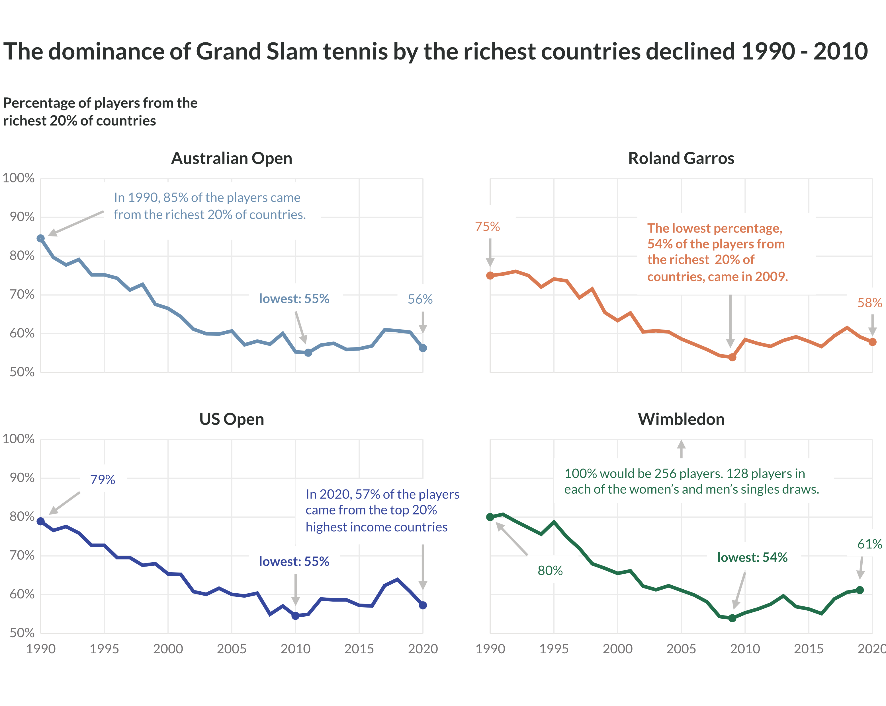

After 30 years or so of watching tennis, I had a hunch that the top level of the sport was becoming slightly more open to players from outside the very richest countries. After a lot of data cleaning and data wrangling (around 800 lines of code) I came up with the chart above. It shows that the dominance of Grand Slam tennis by the richest 20% of countries has indeed declined.

To produce the chart, I needed data on the women's and men's singles entrants for each Grand Slam tournament since 1990. This came from the excellent [Tennis Abstract](https://github.com/JeffSackmann). I also needed data on the wealth of countries. This came from [Our World in Data](https://ourworldindata.org/grapher/gdp-per-capita-worldbank?tab=chart).

In the rest of this R notebook, I go through the data cleaning process that enabled me to create the chart. I used a range of techniques and approaches, including:

- Reading in multiple csvs and combining the data.
- Tidying data.
- Identifying and imputing missing data.
- Dealing with issues arising from joining data from different sources.
- Web scraping. 
- Using a functional programming approach to generate multiple exploratory plots.


<br/>
<a rel="license" href="http://creativecommons.org/licenses/by-nc-sa/4.0/"></a><br />This work is licensed under a <a rel="license" href="http://creativecommons.org/licenses/by-nc-sa/4.0/">Creative Commons Attribution-NonCommercial-ShareAlike 4.0 International License</a>.


## 1. Notebook Setup

```{css, echo=FALSE}


  @import url('https://fonts.googleapis.com/css2?family=Poppins&display=swap');

	h1,	h2,	h3,	p,	li,	tbody {
		font-family: 'Poppins', sans-serif;
		color: #404040;
	}
	
	p, li {
	font-size: 1.7rem;
  }
  
  image, table {
    margin-bottom: 2rem;
		margin-top: 2rem;
  }
  
  .r {
  font-size: 1.5rem;
  }


	h2 {
		line-height: 1.1;
		padding-bottom: 8px;
		font-weight: bold;
		margin-top: 3rem;
	}


	h3 {
		text-align: left;
		line-height: 1.5;
		font-weight: bold;
		margin-bottom: 1.5rem;
		margin-top: 3rem;
	}

	a {
		color: #355070;
	}

	.main-container {
		max-width: 1200px;
		min-width: 300px;
		margin-left: auto;
		margin-right: auto;
		padding-left: 9%;
		padding-right: 9%;
	}
```

```{r, include=FALSE}
knitr::opts_chunk$set(
  warning = FALSE, message = FALSE,
  fig.align = 'center',
  out.width = "100%"
)
```


```{r}
library(tidyverse)  # for data manipulation and plotting
library(rvest)      # for webscraping

# ------------------------------------------------------------------------------
# set up for plotting
# ------------------------------------------------------------------------------

# default ggplot2 theme for the notebook
theme_set(theme_minimal())

# colour palette for exploratory charts
highlight_colour <-  "#35469D"

```

## 2. The Tennis Data


I started with reading in the raw tennis data for github. This includes match results for tournaments going back to 1920. The results are stored in two separate repos, one for the women's tour (wta) and one for the men's tour (atp). The matches for each year are stored in separate csvs. As a starting point, the code below creates a single dataframe including all these results.


```{r}
#' Get WTA or ATP tour match results from the Tennis Abstract github for the specified year (https://github.com/JeffSackmann)
#'
#' @param year an integer. The earliest years where there are data: wta 1920; atp 1968.
#' @param tour a string either 'wta' or 'atp'
#'
#' @return a dataframe of match results 

get_res <- function(year, tour){

  # form file location string based on year and tour
  repo_url <- glue::glue("https://raw.githubusercontent.com/JeffSackmann/tennis_{tour}/master/")
  file_name <- glue::glue("{tour}_matches_{year}.csv")
  file_location <- str_c(repo_url, file_name)
  #browser()

  # read in data from csv on github
  res_year <- read_csv(file_location,
                      
                      # address issue with column type being read differently
                      # in different files
                      col_types = list(winner_seed = col_double(),
                                         loser_seed = col_double(),
                                       draw_size = col_double())) %>% 
    
    # make variable names consistent
    janitor::clean_names() %>%

    # add identifiers
    mutate(tour = tour, 
           year = year)

  return(res_year)
}

# ------------------------------------------------------------------------------
# download results
# ------------------------------------------------------------------------------

start_year <- 1968
end_year <-  2022

# aggregate atp results into a single dataframe
atp_results <- seq(start_year, end_year) %>% 
  map_df(~get_res(., "atp"))

# aggregate wta results into a single dataframe
wta_results <- seq(start_year, end_year) %>% 
  map_df(~get_res(., "wta"))

# show the data structure in the notebook
head(arrange(atp_results, tourney_date))
head(arrange(wta_results, tourney_date))

```

### 2.1 Tidying the data


After a quick look at the dataframes it was clear to me that the data was not in a [tidy form](https://tidyr.tidyverse.org/articles/tidy-data.html). Actually, it is untidy in some pretty interesting ways. Single variables are split across two columns. For example, `winner_age` and `loser_age` are actual a single variable `age`. It is the same for the  nationalities of players, which I'll need later on to create the chart. They are split across two columns `winner_ioc` and `loser_ioc`.

In the process of tidying the data,  each observation in the datframe becomes one players participation in one match. This makes things much easier later on. In the raw data, observations are the matches themselves.


```{r}
#' Get observations relating to either match winners or losers from 
#' tennis abstract match raw result data
#'
#' @param raw_results_df a dataframe of tennis abstract match result raw data
#' @param result specifies whether `winner` or `loser`data should be returned
#'
#' @return a dataframe of match data for either winners or losers

get_data_by_result <- function(raw_results_df, result){
  
  res_to_retain <- result
  
  if(res_to_retain == "winner"){
    res_to_retain_suffix <- "w_"
    res_to_drop <- "loser"
    res_to_drop_suffix <- "l_"
  }
  
  else if (res_to_retain == "loser"){
    res_to_retain_suffix <- "l_"
    res_to_drop <- "winner"
    res_to_drop_suffix <- "w_"
  }
  
  # tidy up data for match losers
  raw_results_df %>%

    # drop columns containing match stats of the winner
    select(-c(starts_with(res_to_drop), starts_with(res_to_drop_suffix))) %>%

    # simplify column naming to enable row binding of winners and losers
    rename_with(.fn = ~str_replace( .x, str_c(res_to_retain, "_"), ""),
                .cols = starts_with(res_to_retain)) %>%
    rename_with(.fn = ~str_replace( .x, res_to_retain_suffix, ""),
                .cols = starts_with(res_to_retain_suffix)) %>%

    # add result column and match_id
    mutate(result = res_to_retain,
           match_id = 1:n(),
           match_id_str = str_c(match_id, tour, year, sep = "_"),
           .after = name)
  
}


#' Puts tennis abstract match raw result data in a tidy form
#'
#' @param raw_results_df a dataframe of tennis abstract match result raw data
#'
#' @return a tidy dataframe of tennis abstract match results data

tidy_match_results <- function(raw_results_df){
  
  losers <- get_data_by_result(raw_results_df, "loser")
  winners <- get_data_by_result(raw_results_df, "winner")
  
  results_tidy <- 
    
    # recombine data on winning and losing players
    bind_rows(losers, winners) %>% 
    
    # order for readability
    arrange(year, tour, match_id) %>% 
    
    # convert variable types where needed
    mutate(tourney_date = lubridate::ymd(tourney_date))
  
  return(results_tidy)
}

# ------------------------------------------------------------------------------
# tidy results
# ------------------------------------------------------------------------------

atp_results_tidy <- tidy_match_results(atp_results)
wta_results_tidy <- tidy_match_results(wta_results)

# create single dataframe with results from both tours
all_results_tidy <- bind_rows(
  atp_results_tidy, wta_results_tidy
)

```

After all that tidying, we have a single dataframe with all the results, men's and women's singles. The first few lines of the data look like this.

```{r}
head(all_results_tidy)
```
```{r include=FALSE}
write_csv(all_results_tidy, "data/all_results_tidy.csv")
```


### 2.2. Focussing on the relevant data

Up until this point, I had been working with data relating to tennis matches at many different torunaments. For the chart I was making I only needed Grand Slam results. So, now was the time to focus in. Even more specifically, I only needed a few details about the players appearing in the first round of Grand Slam tournaments. The code chunk below got me to where I wanted to be. 

```{r}
results_focused <- all_results_tidy %>% 
  
  # focus on entrants to grand slam tournaments
  filter(tourney_level == "G") %>% 
  
  # focus on variables of interest
  select(year, tourney_name, tour, name, id, 
         country_code = ioc) %>% 
  
  # remove duplicates where players have appeared in multiple rounds 
  unique()

# show the structure of the data
head(results_focused)
```

### 2.3. Checking for missing data

I had wanted to look at the dominance of Grand Slams by players from the richest countries from the start of the Open Era (1969). Unfortunately, I couldn't do that as I ran into potential some missing data issues.

I had assumed there had always been 128 players in the first round of each singles draw. So a total of 256 players at each Grand Slam. In the code chunk below, I looked at the number of singles players for each tournament as a way to identify missing data. 

I saw some tournaments with fewer than 256 players before 1989. Checking online records for some of these tournaments, I could see that some did indeed have men's or women's draws with less than 128 entrants. 

Rather than manually checking the number of players at the apparently smaller tournaments were correct, I decided to refine the scope of the analysis to look at Grand Slam tournaments from 1990 onwards. The code below also confirms that all post 1990 tournaments have 256 singles players. So no missing data post 1990.


```{r}
# look for missing data in post 1968 results
results_focused %>% 
  count(year, tourney_name) %>% 
  filter(n != 256)

# focus on Grand Slams from 1990 onwards
results_clean <- results_focused %>% 
  filter(year >= 1990) %>% 
  
  # correct and issue with tournament names being different for the US Open 
  # Men's and Women's Singles in 2019.
  mutate(tourney_name = replace(tourney_name, 
                                tourney_name == "Us Open",
                                "US Open"))

# confirm there is no missing data for Grand Slams 1990 onwards
num_missing <- results_clean %>% 
  count(year, tourney_name) %>% 
  filter(n != 256) %>% 
  nrow()

assertthat::assert_that(num_missing == 0)
```
That is about it for cleaning the tennis data for now. Before moving on to other dataset. The data on the wealth of countries since 1990, here is how the first few observations of the clean tennis data look. I'm not sure why Michael Brown has `B395` as part of his name! I didn't need player names for my chart, so I didn't worry about that too much.

```{r}
head(results_clean)
```


## 3. GDP data

The data I used on the wealth of countries was GDP per capita data from [Our World in Data](https://ourworldindata.org/grapher/gdp-per-capita-worldbank?tab=chart). The GDP per capita data was much more straight-forward  to read in and tidy, than the tennis result data. It is all done in the code chunk below. The main thing to note is that the data included geographical entities that are not individual countries, such as continents and regions. It made sense to remove these.

```{r}
gdp_focus <- read_csv("data/gdp-per-capita-worldbank.csv") %>% 
  
  # make variable names consistent
  janitor::clean_names() %>% 
  
  # rename variables to make them easier to work with 
  rename(gdp_per_capita = gdp_per_capita_ppp_constant_2017_international,
         country = entity,
         country_code = code) %>% 
  
  # focus on 1990 onwards in line with Grand Slam entrant data
  filter(year >= 1990)

# remove entities which are not countries (e.g. regions or continents)
# i.e. those which do not have country codes
non_country_entities <- gdp_focus %>% 
  filter(is.na(country_code)) %>% 
  distinct(country) %>% 
  .$country

gdp_focus <- gdp_focus %>% 
  filter(!country %in% non_country_entities) %>% 
  filter(country != "World")
  
  
```
### 3.1. Checking for missing data

On first glance there is no missing data for GDP per capita, there are no NAs in the dataframe. However, I wanted to check for implicitly missing data too. In this case that would be missing year-country combinations. Here I did pick up some implicitly missing data.

```{r}
# -----------------------------------------------------------------------------
# explore explicitly missing data
# -----------------------------------------------------------------------------
visdat::vis_miss(gdp_focus) +
  labs(title = "No explicitly missing data")

# -----------------------------------------------------------------------------
# explore implicitly missing data
# -----------------------------------------------------------------------------

# create a dataframe with all combinations of year and country
gdp_focus_exp_grid <-  expand_grid(country = unique(gdp_focus$country),
            year = unique(gdp_focus$year)) %>%
  
  # add in gdp data where available
  left_join(gdp_focus)

# show implicitly missing data
gdp_missing <- gdp_focus_exp_grid %>% 
  filter(is.na(gdp_per_capita))

visdat::vis_miss(gdp_focus_exp_grid) +
  labs(title = "But there is implicitly missing data")

head(gdp_missing)

```

### 3.2. Exploring and imputing missing data

From initial inspection of the data (see chunk below), it looked like where GDP per capita data was missing for a country, it tended to be missing for a number of years starting at 1990. The missing data was then followed by complete data up until 2020. 

```{r}
# look at countries with missing data
gdp_missing %>% 
  count(country)

countries_gdp_missing <- unique(gdp_missing$country)

# look at where the missing data is in each country's time series
gdp_missing %>% 
  arrange(country, year)

p <- gdp_focus_exp_grid %>% 
  
  # only need to plot countries with missing data
  filter(country %in% countries_gdp_missing) %>% 
  
  # create the plot
  ggplot(aes(year, gdp_per_capita, group = country)) +
    geom_line(alpha = 0.8, colour = highlight_colour) +
      
    labs(title = "Countries with missing GDP per capita data",
         subtitle = "Hover over lines to see which countries",
         x = NULL,
         y = "GDP per capita") +
    
    # dollar axis labels
    scale_y_continuous(labels=scales::dollar_format()) +
  
    # adjust y axis title for readability
    theme(axis.title.y = element_text(margin = margin(r=10)))

# make interactive with tooltips for data exploration
plotly::ggplotly(p)
  
```

I tried using an interpolation function, from the `zoo` package, to impute the missing data. However, given the data was often missing at the start of time series, there was some strange interpolation behaviour. See plot below. 

```{r}
library(zoo)

# select countries to highlight strange interpolation behavior
strange_interpolation <- c("Kosovo", "Cayman Islands", "Iceland")

p <- gdp_focus_exp_grid %>% 
  mutate(
    gdp_per_capita = zoo::na.approx(gdp_per_capita),
    highlight = country %in% strange_interpolation) %>% 
  # only need to plot countries with missing data
  filter(country %in% countries_gdp_missing) %>% 
  
  # create the plot
  ggplot(aes(year, gdp_per_capita, 
             group = country, 
             colour = highlight)) +
    
    geom_line(alpha = 0.8) +
    
    scale_colour_manual(values = c("#C7C2C4", highlight_colour)) +
  
    labs(title = "Strange behaviour with interpolation function",
         x = NULL) +
    
    # dollar axis labels
    scale_y_continuous(labels=scales::dollar_format()) +
    theme(legend.position = "none")

# make interactive with tooltips for data exploration
plotly::ggplotly(p)
```
So, I use a simple interpolation method, based on the pattern of missing data. I assumed that where data was missing for a country, say between 1990 and 1995. I would use the first available  GDP per capita observation to fill the gaps for missing years. So, in this example the GDP per capita for 1996 would be used to the fill the missing data gaps between 1990 and 1995. 

```{r}
# -----------------------------------------------------------------------------
# find the earliest record of gdp_per_capita for each country
# -----------------------------------------------------------------------------

earliest_gdp <- gdp_focus_exp_grid %>% 
  
  # focus on relevant observations
  filter(!is.na(gdp_per_capita),
         country %in% countries_gdp_missing) %>% 
  
  # identify earliest year with gdp_per_cap observation
  group_by(country) %>% 
  mutate(min_year = min(year)) %>% 
  ungroup() %>% 
  
  # focus only on each countries earliest year with gdp_per_cap observation
  filter(year == min_year) %>% 
  
  # retain only the columns needed to simplify the join below
  select(earliest_gdp_per_capita = gdp_per_capita,
         country_code,
         country)

# -----------------------------------------------------------------------------
# for each country replace missing gdp_per_capita data with earliest 
# gdp_per_cap observation
# -----------------------------------------------------------------------------

gdp_clean <- gdp_focus_exp_grid %>% 
  
  left_join(earliest_gdp, by = c("country" = "country")) %>% 
  
  # replace nas
  mutate(gdp_per_capita = 
           if_else(
              is.na(gdp_per_capita), 
              earliest_gdp_per_capita, 
              gdp_per_capita
              ),
    
         country_code =
           if_else(
              is.na(country_code.x),
              country_code.y, 
              country_code.x
              )
    ) %>% 
  
  # tidy up dataframe
  arrange(country,year) %>% 
  select(-c(country_code.x, country_code.y, earliest_gdp_per_capita))

```


## 4. Joining the two datasets

Having cleaned and reshaped the tennis results and gdp per capita datasets, it was time to join the two datasets together. In both datasets there is a country code (e.g. GBR for Great Britain), so I used this for the join. I wrote a quick function below to test the performance of the join, in terms of how many countries codes were successfully matched to join the two datasets. Unfortunately, initial performance of the join was poor, with only 55 of 90 country codes matched.

```{r}

#' Quickly check how well two dataframes join
#'
#' @param df1 the dataframe passed as the first argument to the 
#' @param df2 
#' @param join_func the specific join function to be applied (e.g. left_join)
#' @param ... other parameters to be passed to the join function
#' 
#' @return a vector including the number of observations which are of join successes and failures

join_performance <- function(df1, df2, join_func, ...){
  
  # perform the join
  join <- df1 %>%
    join_func(df2, ...)
  
  # the number of observations which are of join failures
  num_join_miss <- join %>% 
    filter(is.na(gdp_per_capita)) %>% 
    distinct(country_code) %>% 
    nrow()
  
  # the number of observations which are of join successes
  num_join_hit <- join %>% 
    filter(!is.na(gdp_per_capita)) %>% 
    distinct(country_code) %>% 
    nrow()

  # return the number of observations which are of join successes and failures
  c("join_sucesses" = num_join_hit, "join_failures" = num_join_miss)
}

#-------------------------------------------------------------------------------
# prepare the two data frames for joining
#-------------------------------------------------------------------------------
# gdp data only goes up to 2020, so remove 2021 and 2022 match data
results_clean <- filter(results_clean, year <= 2020) %>% 
  # remove any white space ahead of using to join with gdp data
  mutate(country_code = str_trim(country_code, side = "both"))

# remove any white space ahead of using to join with tennis data
gdp_clean <- gdp_clean %>% 
  mutate(country_code = str_trim(country_code, side = "both"))
  
#-------------------------------------------------------------------------------
# look at initial join performance
#-------------------------------------------------------------------------------
join_performance(results_clean, 
  gdp_clean,left_join)

```

I realised that the two datasets were using different naming standards. ISO codes in the gdp data, and IOC codes for the tennis data. So, I web scraped a lookup table for converting between the two standards from Wikipedia. This improved the join performance considerably, see code output below.

```{r}
#-------------------------------------------------------------------------------
# web scrape a look up table for mapping between iso country codes (gdp data)
# and ioc codes (tennis data)
#-------------------------------------------------------------------------------

lookup_raw <- read_html("https://simple.wikipedia.org/wiki/Comparison_of_IOC,_FIFA,_and_ISO_3166_country_codes") %>% 
  html_nodes(xpath="/html/body/div[1]/div/div[4]/main/div[2]/div[3]/div[1]/table[1]") %>% 
  html_table() %>% 
  pluck(1)

iso_ioc_lookup <- lookup_raw %>%
  janitor::clean_names() %>% 
  select(ioc, iso)

#-------------------------------------------------------------------------------
# replace iso country codes in gdp data with ioc codes (as used in tennis data)
#-------------------------------------------------------------------------------

gdp_clean_ioc <- gdp_clean %>% 
  left_join(iso_ioc_lookup,
            by = c("country_code" = "iso"))

# just one country without an ioc code so ignore
gdp_clean_ioc %>% 
  filter(is.na(ioc))

gdp_clean_ioc <- gdp_clean_ioc %>% 
  mutate(country_code = ioc) %>% 
  select(-ioc)

#-------------------------------------------------------------------------------
# check if join performance has improved
#-------------------------------------------------------------------------------

join_performance(results_clean,
                 gdp_clean_ioc,left_join)

```
I thought with a bit of manual intervention, I could probably improve the join performance a little more. So, I took a look at the tennis players (and their nationalities), where it was not possible to match up GDP per capita data.

```{r}
# look at players/countries where no match to gdp data

no_match <- results_clean %>% 
  left_join(gdp_clean_ioc) %>% 
  filter(is.na(gdp_per_capita)) 

no_match %>% 
  distinct(year, name, country_code)

no_match %>% 
  distinct(country_code)

```

I could see that some of the issues related to countries that no longer exist, for example the USSR. As an approximation, I thought where possible these could be replaced with a current and related country, for example Russia. After some manual updates this improved the join performance a little further, and I was happy to call the joined data good enough to work with. It wasn't possible to match up GDP per capita data for 5 countries in the tennis results data. None of these 5 countries were major tennis playing countries.

```{r}
# -----------------------------------------------------------------------------
# Identify predecessor countries and check for the names of countries with 
# no gdp data
# -----------------------------------------------------------------------------
# set up string for searching within country names
country_check <- c("ven" = c("venezuela"),
                   "yug" = c("yugoslavia"),
                   "cub" = c("cuba"),
                   "mon" = c("monaco"),
                   "tpe" = c("taiwan"),
                   "tch" = c("czechoslovakia", "cz"),
                   "urs" = c("soviet union", "ussr", "russia"),
                   "scg" = c("serbia", "montenegro"),
                   "lie" = c("liechtenstein", "liech", "germany"))

# combine country search strings into a single regular expression
# | is OR
country_check_str <- str_c(country_check, collapse = "|")

# search strings found in the following countries present in the dataset 
matches_found <- gdp_clean_ioc %>% 
  mutate(country_check = str_detect(str_to_lower(country), country_check_str)) %>% 
  filter(country_check) %>% 
  distinct(country, country_code)
matches_found

# -----------------------------------------------------------------------------
# Where possible find a country that approximately matches for countries with 
# no gdp data
# -----------------------------------------------------------------------------
country_code_replacement_lookup <- matches_found %>% 
  mutate(code_to_replace = c("TCH", "LIE", NA, "URS", "SCG" )) %>% 
  rename(replacement_code = country_code) %>% 
  select(-country) %>% 
  filter(!is.na(code_to_replace)) 

results_clean <- results_clean %>% 
  left_join(country_code_replacement_lookup, 
            by = c("country_code" = "code_to_replace")) %>% 
  mutate(country_code = if_else(!is.na(replacement_code),
                                replacement_code, 
                                country_code)) %>% 
  select(-replacement_code)

#-------------------------------------------------------------------------------
# check if join performance has improved
#-------------------------------------------------------------------------------

join_performance(results_clean,
                 gdp_clean_ioc,left_join)

# good enough
results_gdp <- left_join(results_clean, gdp_clean_ioc)

results_gdp %>% 
  relocate(gdp_per_capita, country) %>% 
  visdat::vis_miss()
```

```{r include=FALSE}
results_gdp %>% 
  left_join(iso_ioc_lookup, by = c("country_code" = "ioc")) %>% 
  rename(ioc = country_code) %>% 
  write_csv("data/results_gdp.csv")
```


## 5. Exploratory data analysis

Before creating the chart itself, I did some quick exploratory data analysis, looking for any interesting trends. 

First, it was a case of looking at how many first round grand slam appearances where made by players from each country each year. I then produced a couple of exploratory plots. 

- The first looks at the number of countries represented in Grand Slam draws each year, as I wondered if there were any interesting trends around this. 
- The second (interactive) plot shows the number of first round grand slam appearances made by players from each country over time. The number of Grand Slam appearances from players for USA shows a big decline between 1990 (262 appearances) and 2011 (85 appearances)!

```{r}
# -----------------------------------------------------------------------------
# calculate number of first round grand slam entrants for each country each
# year
# -----------------------------------------------------------------------------
num_gs_entrants <- results_gdp %>% 
  group_by(year, country) %>% 
  mutate(num_first_rd = n()) %>% 
  ungroup() %>% 
  select(-c(id, name, tour, tourney_name)) %>% 
  distinct() %>% 
  arrange(year, desc(num_first_rd))

head(num_gs_entrants)

# num of countries represented in first round of grand slam singles
num_countries <- num_gs_entrants %>% 
  count(year) %>% 
  rename(num_countries_represented = n)

# -----------------------------------------------------------------------------
# create exploratory plots
# -----------------------------------------------------------------------------

ggplot(num_countries, aes(year, num_countries_represented)) +
  geom_col(fill = highlight_colour, width = 0.8) +
  labs(x = NULL,
      y = "Number of countries represented in at a Grand Slam")

p <- ggplot(num_gs_entrants, aes(year, num_first_rd, group = country)) +
        geom_line(alpha = 0.5, colour = highlight_colour) +
        labs(y = "Number of Grand Slam first round appearances",
             x = NULL)

plotly::ggplotly(p) # make interactive to explore which line is which country
```
Seeing the drop off in Grand Slam appearances by American players, I got back to thinking about the wider trend amongst the richest countries (by GDP per capita). However, I wasn't sure exactly where to set the cutoff for the richest countries. Should I focus on the top 10% of richest countries or the top 50%? So, I decided to take a look at the trends for each options. The top 10%, 20%, 30% etc. of countries. You can see all 10 of the plots below. After a quick look at the plots I settled on focusing on the top 20% of richest countries, as this looked the most interesting trend.

```{r}
# calculated country income deciles for each country
# use gdp data (all countries) rather than tennis data (subset of countries)
income_deciles <- gdp_clean_ioc %>% 
  group_by(year) %>% 
  mutate(income_decile = ntile(gdp_per_capita, 10)) %>% 
  ungroup() %>% 
  select(-c(country, gdp_per_capita))


# add the newly calculated deciles into the tennis/gdp dataframe
num_gs_entrants_inc_dec <- num_gs_entrants %>% 
  left_join(income_deciles) 

#' Plot the percentage of Grand Slam First Round appearances made by players 
#' from countries in the top n percentage of highest income
#'
#' @param df a dataframe containing the grand slam first round appearance data
#' @param decile integer between 1 and 10

plot_top_n_perc <- function(df, decile){

  # create a variable names and plot title based on the decile chosen
  top_n_perc <- (10 - decile + 1) * 10
  var_str <- str_c("top_", top_n_perc, "_perc")
  plot_title <- str_c("The top ", top_n_perc, "% highest income countries\n")

  
  df <- df %>% 
    group_by(year) %>% 
    mutate(is_top_n_perc = income_decile >= decile) %>% 
    ungroup()
  

  # calculate number of first round appearance for top n % of countries
  df_plot <- df %>%
    
    na.omit() %>%
    
    group_by(year, is_top_n_perc) %>%
    summarise(num_first_rd = sum(num_first_rd)) %>%
    ungroup()
    
  df_plot <-  df_plot %>%   
    group_by(year) %>%
    mutate(perc_first_rd = num_first_rd / sum(num_first_rd) * 100) %>% 
    ungroup() %>% 
    filter(is_top_n_perc)
  
  
  # create the plot itself
  df_plot %>%
    ggplot(aes(year, perc_first_rd)) +
      geom_line(colour = "#374E83") +
      
      # tidy up labelling of the plot
      labs(x = NULL, y = NULL,
           
           # put y axis label at the top of the y axis
           subtitle = "Percentage of first round\nGrand Slam appearances\n",
           
           # identify the top n % for the plot
           title = plot_title) +
      
      # tidy up axis
      scale_y_continuous(labels = scales::label_percent(scale = 1),
                         limits = c(0,100)) +
      scale_x_continuous(breaks = seq(1990, 2020, 5)) +
      coord_cartesian(expand = FALSE, clip = "off") +
      
      # tidy positioning of text and gridlines
      theme(panel.grid.minor.x = element_blank(),
            plot.title.position = "plot",
            plot.margin = margin(t = 20, r = 30, b = 20, l = 20, unit = "pt"))

}

#-------------------------------------------------------------------------------
# create exploratory plots for the top n percent of highest income countries
#-------------------------------------------------------------------------------

seq(10,1) %>% 
  map(~plot_top_n_perc(num_gs_entrants_inc_dec, .))
```

## 6. Producing the skelton of the chart (for editting in graphic design software)

The last code-based part of the work, was to create a skeleton of the chart. As you can see it is fairly minimal, this is because I did the annotation and tidying up of the plot using graphic design software (Affinity Designer). I often prefer this workflow to spending hours working out how to tweak the presentation of a plot in the `ggplot2` code. 

While producing the chart skeleton I made the decision to produce separate small multiples plots for each Grand Slam tournament. I thought the idea of all Grand Slam first round appearances in a year wasn't particularly intuitive. Whereas presenting the data for each tournament fit better with how people watch and engage with tennis. It also created more space for annotation of the data and trends.

```{r}
# -----------------------------------------------------------------------------
# calculate number of first round entrants for each grand slam for each country 
# each year
# -----------------------------------------------------------------------------
num_gs_tourney_entrants <- results_gdp %>% 
  
  group_by(year, tourney_name, country) %>% 
  mutate(num_first_rd = n()) %>% 
  ungroup() %>%
  
  select(-c(id, name, tour)) %>% 
  distinct() %>% 
  arrange(year, tourney_name, desc(num_first_rd)) %>% 
  
  # add income deciles
  left_join(income_deciles) %>% 
  
  # test if observation relates to a top 20% income country
  group_by(year) %>% # bug fix
  mutate(top_20_perc = income_decile >= 9) %>% 
  ungroup()

num_gs_tourney_entrants

# -----------------------------------------------------------------------------
# create main data layer for the plot
# -----------------------------------------------------------------------------

# calculate number of first round appearance for top n % of countries
df_plot <- num_gs_tourney_entrants %>%
    
    na.omit() %>%
    
    group_by(year, tourney_name, top_20_perc) %>%
    summarise(num_first_rd = sum(num_first_rd)) %>%
    ungroup() %>%
    
    group_by(year, tourney_name) %>%
    mutate(perc_first_rd = num_first_rd / sum(num_first_rd) * 100) %>% 
    ungroup() %>% 
    filter(top_20_perc)

# -----------------------------------------------------------------------------
# create additional data layers for the plot
# -----------------------------------------------------------------------------
annotation_layer <- df_plot %>% 
  group_by(tourney_name) %>% 
  mutate(min_perc_first_rd = min(perc_first_rd),
         min_year = min(year),
         max_year = max(year)) %>% 
  ungroup() %>% 
  
  filter(min_perc_first_rd == perc_first_rd |
          year == min_year |
           year == max_year)

# -----------------------------------------------------------------------------
# create the plot itself
# -----------------------------------------------------------------------------
p <- df_plot %>%
    ggplot(aes(year, 
               perc_first_rd,
               colour = tourney_name)) +
      geom_line() +
      geom_point(data = annotation_layer) + 
      ggrepel::geom_text_repel(data = annotation_layer,
                                mapping = aes(label = round(perc_first_rd))) +
      
      # tidy up labelling of the plot
      labs(x = NULL, y = NULL,
           
           # put y axis label at the top of the y axis
           subtitle = "Percentage of first round\nGrand Slam appearances\n",
           
           # identify the top n % for the plot
           title = "plot_title") +
  
      scale_colour_manual(values = c("#6A8EAF", "#D97A53", 
                                     "#35469D", "#216E4B")) +
      
      # tidy up axis
      scale_y_continuous(labels = scales::label_percent(scale = 1)) +
      scale_x_continuous(breaks = seq(1990, 2020, 5)) +
      coord_cartesian(expand = FALSE, clip = "off") +
      
      # tidy positioning of text and gridlines
      theme(panel.grid.minor = element_blank(),
            panel.spacing.x = unit(2, "cm"),
            panel.spacing.y = unit(1, "cm"),
            plot.title.position = "plot",
            #plot.margin = margin(t = 20, r = 30, b = 20, l = 20, unit = "pt"),
            legend.position = "none",
            strip.text = element_text(margin = margin(10,5,10,5,"pt")),
            plot.margin = unit(c(2,2,2,2), 'cm')) +
  
      facet_wrap(~tourney_name)

p

ggsave("images/perc_top_20.svg", width = 297, height = 210, units = "mm")

write_csv(num_gs_tourney_entrants, "./data/gs_entries_by_country.csv")

```
## 7. The final chart

In case you need a reminder of what the finished chart looks like, after all the data cleaning work above. Here it is.


